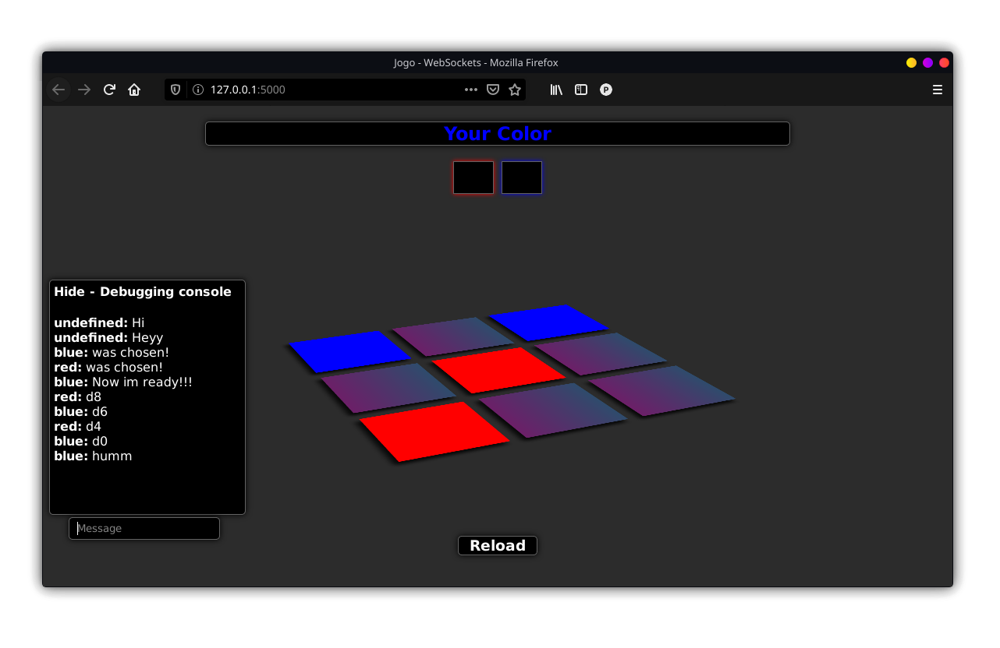

<h1 align="center">Tic-Tac-Toe</h1>


The game is made with Flask and WebSockets, it creates a local server to provide the page and you can play against friends in real time.



### Configure and Run:
```
pip3 install -r requirements.txt

python3 app.py
```
